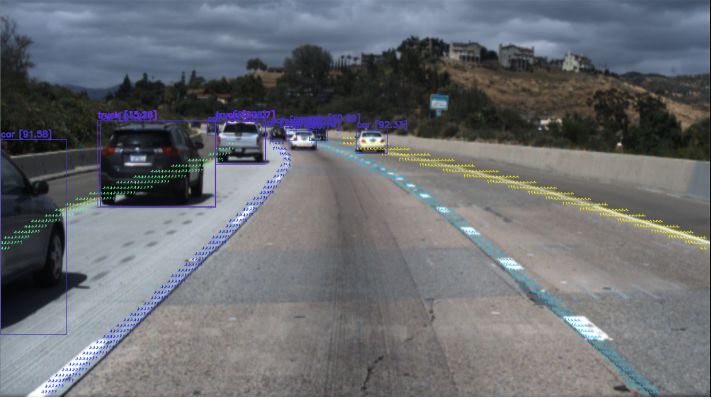

# object_and_lane_detection
I use darknet algorithm for object detection and LaneAF for lane detection.

Here is a picture



After cloning this repo use 

```
python main.py --weights_laneaf LaneAF\tusimple-weights\net_0012.pth --input_img LaneAF\data\tusimple_test_image\3.jpg
```

Testing in real time

